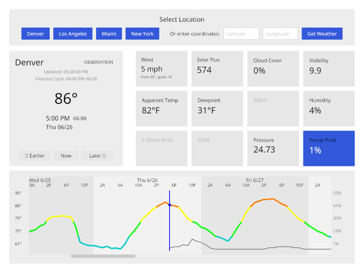

    
# rusty-wx

[Iced](https://iced.rs/) based weather application targeting [Cosmic](https://system76.com/cosmic/) and other compatible desktop environments.

## Development

Unofficial guide to Iced: https://jl710.github.io/iced-guide/  
API reference: https://docs.iced.rs/iced/

[Zed](https://zed.dev) is a recommended IDE

## Install

If needed install Rust using [rustup](https://rustup.rs/):

```bash
curl --proto '=https' --tlsv1.2 -sSf https://sh.rustup.rs | sh
```

Clone and run:

```bash
git clone <repository-url>
cd rust-wx
cargo run
```

Or install permanently:

```bash
cargo install --path .
```

## Screenshot


